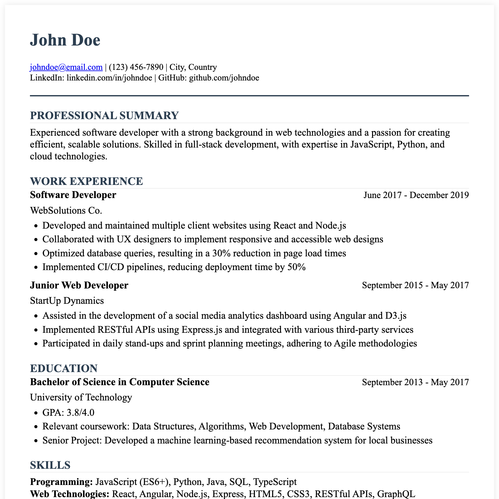

# Styled-md
Create **beautiful**
**portable**, **printable** files from markdown!

[templates/Stylized Invitation I](https://github.com/karlz97/styled-md/blob/main/templates/Letter%20II.png?raw=true)

## Introduction
*Styled-md* is an opensource app that creates beautiful portable & pritable files (.pdf, .png and .webarchive) from markdown!
- **Easy to use**: Just write your markdown and render in real-time.
- **Template-market**: Build your document from a variety of templates: resume, letter, invitation, and more.
- **Local, light and private**: This app runs completely on your browser, no data is sent to the server.
- **Open-source**

## Edit
**Document Title**: The name of your document, this is the file name when you export pdf/png.

**Input Fields**: input fields like "Header" and "Main" apply your content to different style and typeset to create the document.
- Every modification is rendered lively on the *preview panel*.
- Only text content supported currently .

**Export PDF**:  Click Export PDF will create a new tab, then use browser printer(cmd/control + P) to generate pdf.

**Export png/Canvas PDF**
- This approach will render the content to a canvas and export the canvas to png or pdf.
- Play with "Flex", "border" and "Stretch" in the left panel to adjust the position of your content in the generated page.

## About the App

**Buy Me a Coffee**: If this app helped you twice or more, please consider buying me a coffee to support my work. Thank you!

**How to contribute:**
- Create your owe template
- Contribute to the code
- Suggestion, feedbacks and issues are more than welcome!
